# Microsoft Dev Box - Level-Up Lab Instructions

The following lab guide is broken down into the tasks required by each persona that plays a role in the lifecycle of Microsoft Dev Box. 

To complete the entire series of labs you must complete each persona's tasks. 

The three personas we cover are:
-   IT / Dev Infra Team Member (IT Admin)
-   Dev Team Lead (Development Manager)
-   Developer

## Contents

- [Microsoft Dev Box Level-Up Lab Instructions](#microsoft-dev-box-level-up-lab-instructions)

- [Pre-lab setup](#pre-lab-setup)

  - [Designate your user accounts for this and future labs](#designate-your-user-accounts-for-this-and-future-labs)

- [Lab 1 - IT Admin Persona](#lab-1-it-admin-persona)

  - [Create base resources](#create-base-resources)

  - [Create a virtual network](#create-a-virtual-network)

  - [Create a network connection](#create-a-network-connection)

  - [Create the Dev Center](#create-the-dev-center)

  - [Attach the network connection](#attach-the-network-connection)

  - [Preparing a custom Dev Box image](#preparing-a-custom-dev-box-image)

  - [Create a base Dev Box definition with a built-in VM image](#create-a-base-dev-box-definition-with-a-built-in-vm-image)

  - [Create a Dev Box definition with a custom VM image](#create-a-dev-box-definition-with-a-custom-vm-image)

  - [Assign permissions to the other two personas](#assign-permissions-to-the-other-two-personas)

- [Lab 2 - Development Manager Persona](#lab-2-development-manager-persona)

- [Lab 3 - Developer Persona](#lab-3-developer-persona)

  - [Create a Dev Box](#create-a-dev-box)

  - [Use a Dev Box for a simple deployment with Visual Studio](#use-a-dev-box-for-a-simple-deployment-with-visual-studio)

- [Lab 4 - Clean-Up](#lab-4-clean-up)

- [Lab 5 - Already finished? Optional Bonus activities!](#lab-5-already-finished-optional-bonus-activities)

# Pre-lab setup

The steps in this lab guide assume that you have access to an **M365 tenant** with **Microsoft E5 licenses** (or equivalent) provisioned.

The lab guide also assumes that your tenant contains at least one **Azure Subscription where you are the owner**. 
In some places the lab guide assumes that you have provisioned a set of M365 demo accounts. This is not necessary but encouraged to make it easier to follow the instructions.

You should use your tenant's **global administrator account** for the pre-lab tasks.
This is the account that you created when setting up the Microsoft 365 tenant. (youradmin@yourrandomaad.onmicrosoft.com) 
It is not one of the pre-existing demo accounts such as *Adele Vance* or *Alex Wilber*.

Please work through the below steps before starting the first lab.

## Designate your user accounts for this and future labs 

-   Log into the Azure Portal with your global administrator account

-   Go to "Azure Active Directory".

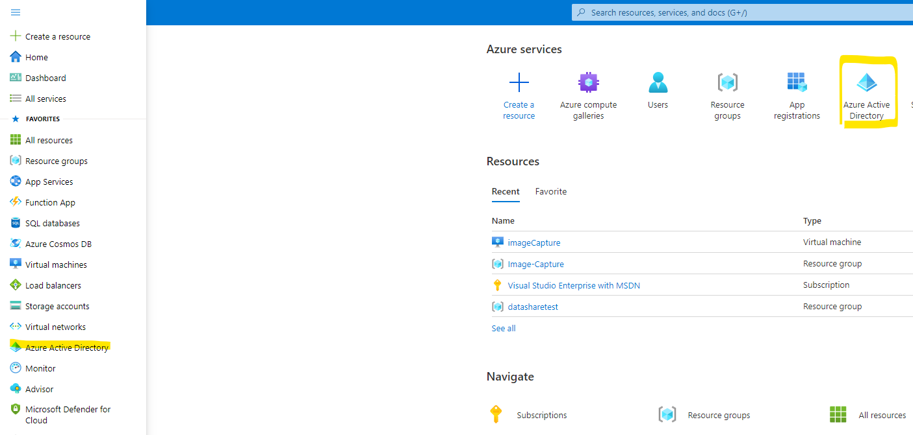

-   Select the "Users" blade in the side bar and review the user
    accounts

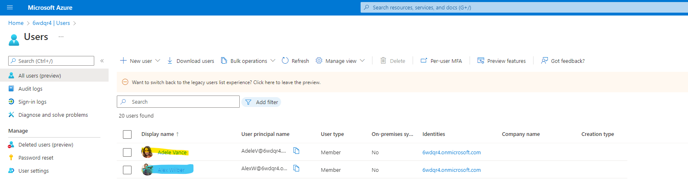

-   Pick two user accounts from the dummy user accounts created during
    your E5 setup. For this and all following labs we will use Adele as
    the Development Manager persona and Alex as the Developer persona.
    You may however pick any other user account that exists in the
    tenant.

> **Note:**
> At the time of writing Microsoft Dev Box does not support guest accounts. This feature is on the roadmap and until it is available, you cannot use guest accounts for some of the tasks outlined.

> **Note:**
> If you do not see any user accounts or only guest and admin accounts here, then your tenant has not got any user profiles pre-provisioned. You can create user accounts by going to the [M365 admin center](https://admin.microsoft.com/adminportal/home#/users and logging in with your global administrator account. When creating user accounts there, you get the option to assign them an E5 licence which is required to use Microsoft Dev Box.

-   **For each user account** (in our case Adele and Alex)

    -   Click the user's name in the blade
    -   A separate user blade will load
    -   Click "Reset Password" and make a note of the user's principal name and password for future steps.
    -   We recommend saving these in a Notepad for the duration of this Level-Up.

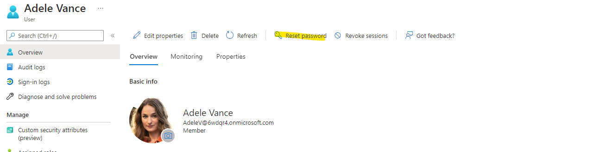

> **Note:**
> When you log into the Azure Portal with these user accounts in later tasks you will need to create a new password for them. Should you forget the new password you set you can follow these steps again to reset their password once again.

> **Note:**
> We do not recommend writing passwords down in a digital plaintext format in production scenarios. We are doing it here to optimize the speed at which you can move through the lab activities.

# Lab 1 - IT Admin Persona

Please perform the following steps as your **global administrator account**.\
The steps in this lab will take you about 45 minutes to 1 hour to complete.

## Create base resources

The next step is to create a range of resources that we will need so our Dev Manager can create Projects which will in turn enable their developers to spin up Dev Boxes.

### Create a virtual network 

-   In the Azure Portal go to the "Create a resource" menu which can be
    found by clicking the menu button in the top left corner of the
    screen and choosing "Create a resource"

-   Once in the menu search "Virtual Network" on the create pane as
    shown. Click "Create"

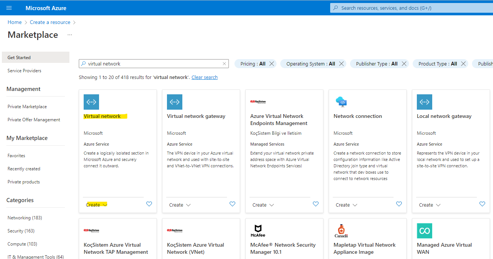

-   Choose **any name for the network** resource and create a new resource group called **"DevCenter-Network"**.

-   We want to keep all of our Dev Center resources **in one Azure Region** including the network to maximize the performance of our Dev Boxes.

-   Please **choose an Azure Region where Dev Box Dev Centers are available**.
    At the time of writing the following Regions are suitable:

    -   Australia East
    -   Europe West
    -   Japan East
    -   Canada Central
    -   UK South
    -   US East
    -   US East 2
    -   US South Central
    -   US West 3

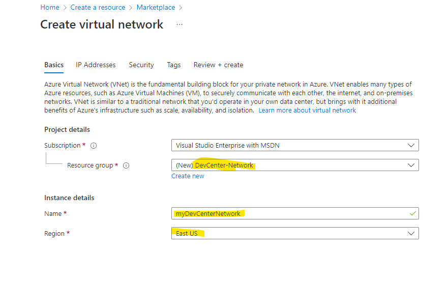

-   For the purposes of the demo environment that we are creating we can leave all other options as they are and click **"Review & Create".**

-   Confirm the details and start the deployment.

### Create a network connection

Once the network is deployed, we need to create a network connection
that we'll be able to leverage for our dev boxes.

-   In the Azure Portal, **go back to the "Create a resource" blade** and search for "Network Connection". Once you find the "Network connection" resource, click **Create**.

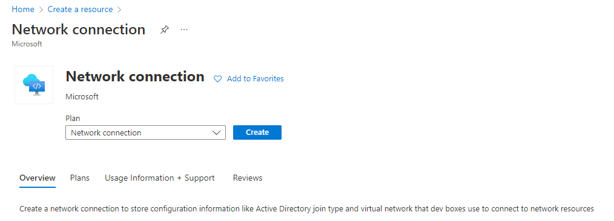

-   Click **"Create"** again.

-   On the next blade, create a new resource group for the connection. Call it **"DevCenter-Core"**.

-   Ensure that **"Azure Active Directory join"** is selected

-   Pick a suitable name for the connection and select the network that was created in the previous step

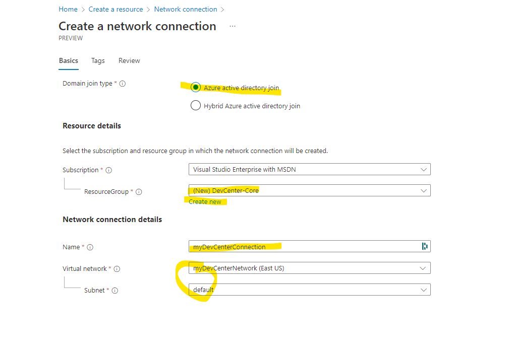

-   Click **"Review & Create"** and confirm the deployment by clicking **"Create"**.

### Create the Dev Center

In the Azure Portal, **go back to the "Create a resource" blade** and in the search box, type **"Dev Center"** and then select "Dev Center" from the list. Click the **"Create"** option.

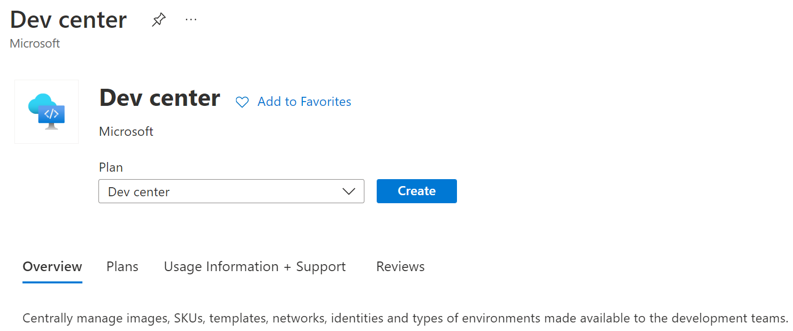

-   Choose the existing **"DevCenter-Core"** resource group for your deployment and give your Dev center a descriptive name.

-   Select **the Azure Region you used when creating the virtual network**

-   Review the deployment and **confirm its creation**

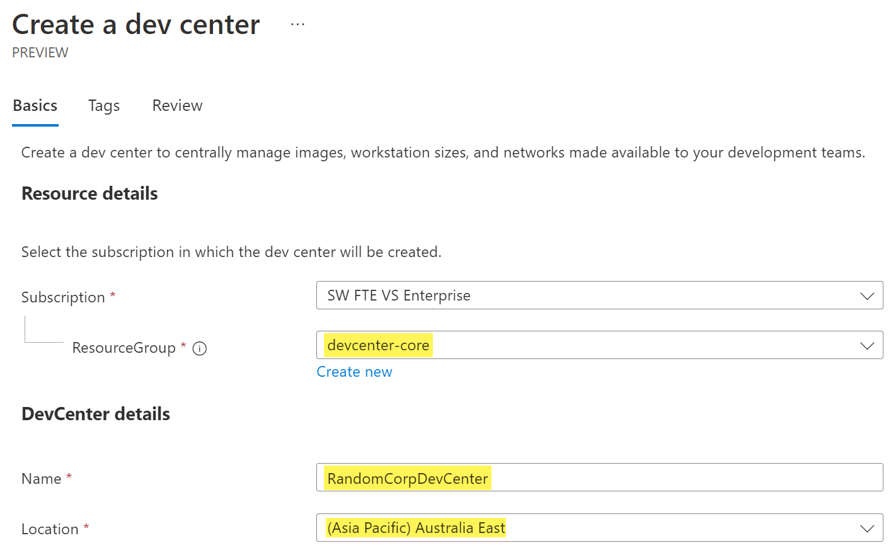

-   After a few moments the Dev center resource should appear in the Azure portal. Navigate to the **"DevCenter-Core" resource group** to find it.

### Attach the network connection

-   Once the **dev center resource** appears in the resource group
    select it to bring up **its resource blade**

-   To attach your network connection, select **"Networking",** then click **"Add network connection"** and **select the network connection** resource that you created in the previous task. Click the **"Add"** button.

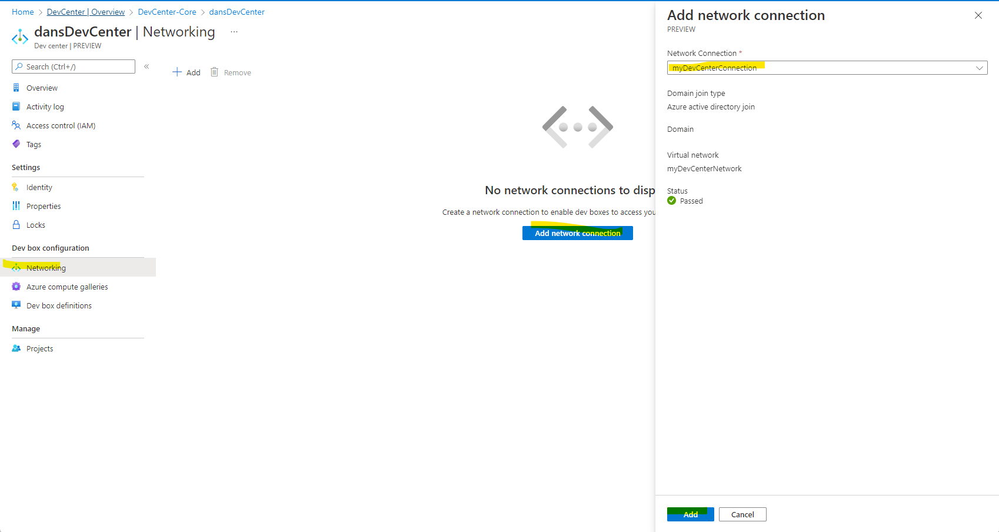

-   Once the process is complete a status message like the one shown below should appear.

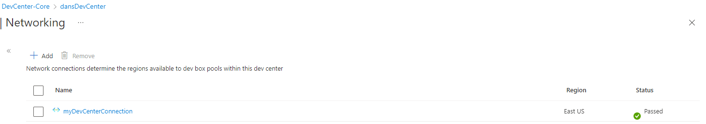

-   The Dev center now knows how to connect new Dev Boxes to your Azure virtual network. Next, we need to create dev box definitions.

### Preparing a custom Dev Box image

While Microsoft Dev Box offers a growing library of images for you to use, many scenarios may require you to bring a custom image.

In this section we will run through the **basic steps to capture a custom image**, which we'll then store in an **Azure Compute Gallery** from where our Dev Center will be able to access it.

-   In the Azure Portal, go back to the **"Create a resource"** blade and search for **"Virtual Machine".**

-   Select the **"Virtual Machine"** icon and hit **"Create"**

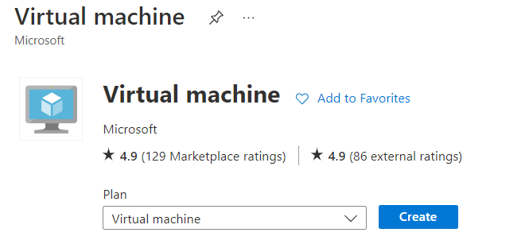

-   In the next bald select **"See all images"** to pick your image
    -   Because we are in an Visual Studio benefit subscription we can simply pick a Windows 11 Enterprise image with Visual Studio.
    -   To find it, type **"Visual Studio 2022"** in the search bar and click the **"Select**" option.

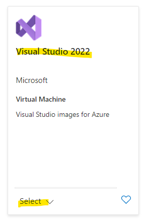

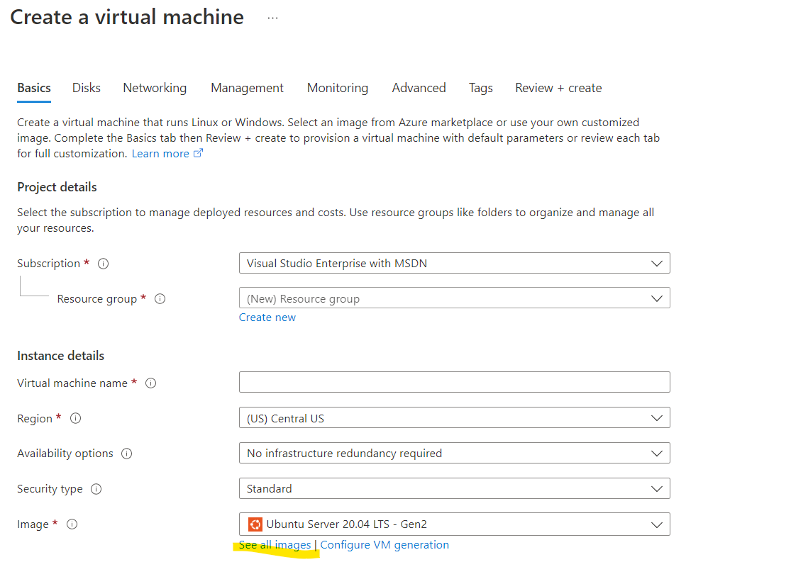

-   In the drop down menu that appears select **"Visual Studio 2022 Enterprise on Windows 11 Enterprise N (x64) - x64 Gen 2"**
> **Note:** Make sure you select the x64 Gen 2 flavour of the image and not x64 Gen 1, otherwise you will run into issues later in the lab.
-   Selecting the image will bring you back to the previous screen.
-   Make the following selections:
    -   Deploy to a new resource group that is different from the ones you used before. You can call it **"Image-Capture"**
    -   Pick a name for the virtual machine and **place it in the region where your other resources are located**
    -   **Set a user name and password.** You may note them down as you'll have to use them to RDP to the VM in the next step.
    -   **All other options can remain as they are.**
-   Confirm all selections and deploy the virtual machine.

Once the deployment is complete head to the new resource group and select the virtual machine.
-   Once on the VM resource blade **choose the option to connect** or copy the IP address into your RDP client.

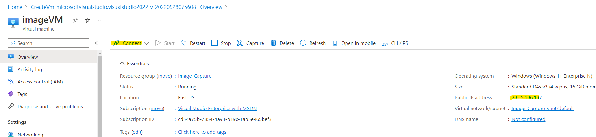

-   Use the credentials that you set in the Create blade earlier and wait for the login process to complete.

We will now proceed to creating a custom image from this VM.

-   Once in Windows 11 on the remote machine, open the start menu and type "Run" in the search bar.

-   Select the **"Run"** application and type **"sysprep"** into it to navigate to the sysprep folder.

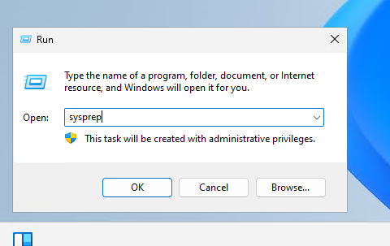

-   Right-click the **sysprep application** and choose **"Run as administrator"**

-   In sysprep use the following options
    -   Choose **"Enter System Out-of-Box Experience**" in the cleanup action dropdown
    -   Tick **"Generalize"**
    -   Choose **"Shutdown"** in the shutdown options dropdown

Sysprep will now get to work and eventually shut the machine down. Once
that happens the machine is generalized and ready to be converted into a
custom VM image.

> **Note:** We are generalizing a newly deployed machine to accelerate this part of the lab. When creating an image yourself you would usually install additional software or make other changes to the image to further customize the experience of the end user.

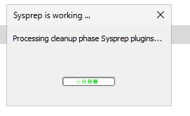

With the remote session now closed you will find yourself back in your browser window.

-   Refresh the browser window to ensure that your machine's status says "Stopped", then click the **"Capture"** icon to start capturing an image.

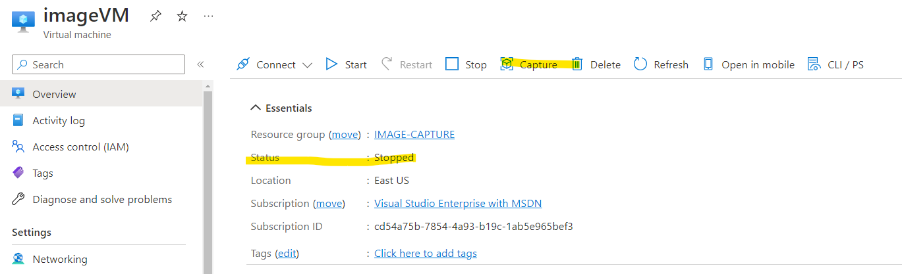

-   Because we have not yet created an Azure Compute Gallery for our custom image, we need to go for **"only a managed image"** in the next blade
-   We also want to make sure we select our **"DevCenter-Core" resource group** as a destination for the image.
-   Choose not to delete the VM for now. **We will ask you to delete it and its resource group later in this lab.**
-   Confirm the creation of the image by clicking **"Review + create"** and confirming the configuration.

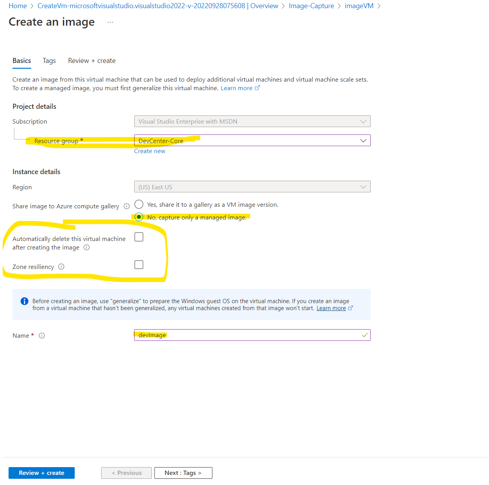

Creating the image will take a few minutes to complete. While you are waiting, you can move to the next step where we will create a Dev Box definition with a built-in VM image, before returning to our custom image.

### Create a base Dev Box definition with a built-in VM image 

-   **Return to the "DevCenter-Core" resource group** in the Azure Portal and select your Dev Center resource.
-   To create a new dev box definition, select **"Dev box definitions"** in the side bar.
-   Select the **"Create"** option in the blade that appears.
-   We will call our definition the **"standard"** definition.

-   Select the **"Windows 11 Enterprise + Microsoft 365 Apps 21H2"** image as this includes standard office apps and teams for you to try later.
-   Select the **"latest"** image version
-   Select **4 vCPUs and 16 GB of RAM**
-   Select the **smallest storage option** to keep costs low

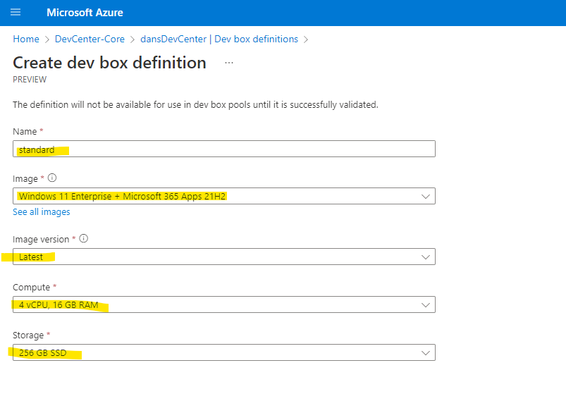

-   Click the **"Create"** button. This makes the definition available to managers in the organization to select for their projects.
-   Once back on the main blade the **"Image Status"** may show as "pending" for a few moments but should soon update to "Succeeded"

### Create a Dev Box definition with a custom VM image 

> **Note:** you can only complete this step once the custom image has been created in your **DevCenter-Core resource group**.

In this step we will add our managed image to a new Azure Compute gallery so that we can use it with Microsoft Dev Box.
To allow our Dev Center to manage images independently we need to also assign a Managed Identity to the resource.

You will need to create **a user-assigned managed identity resource** for your **"DevCenter-Core"** resource group. This managed identity resource is used to allow the Dev Center to manage images in the collection that we'll attach to it in an upcoming step.

-   Navigate back to the **"DevCenter-Core"** resource group.

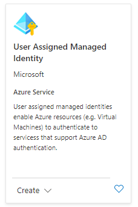

Open the **"Create"** menu and type "User assigned", then select the "User Assigned Managed Identity" resource and choose **"Create".**

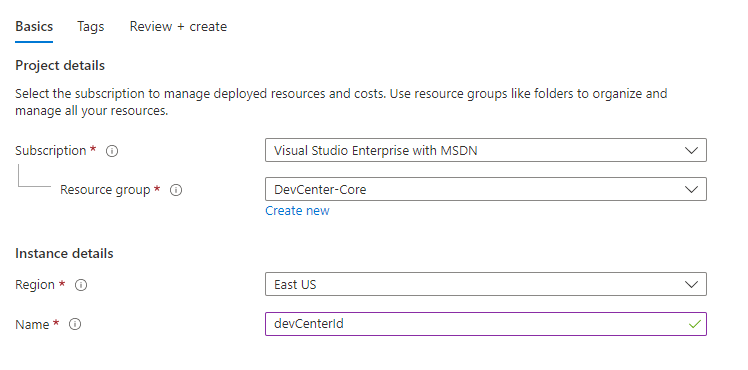

-   **Pick a descriptive name** for the resource and place it in the **DevCenter-Core** resource group.
-   All other options can remain as defaults.
-   Choose the **"Review + Create"** option and **confirm the creation** of the resource.
-   **Return to the "DevCenter-Core" resource group** in the Azure Portal and select your Dev Center resource.
-   Select **"Identity**" in the side bar and then select the **"User assigned"** tab and click **"Add"**
-   Select the managed identity object that you created at the start of this task, then select **"Add"**.

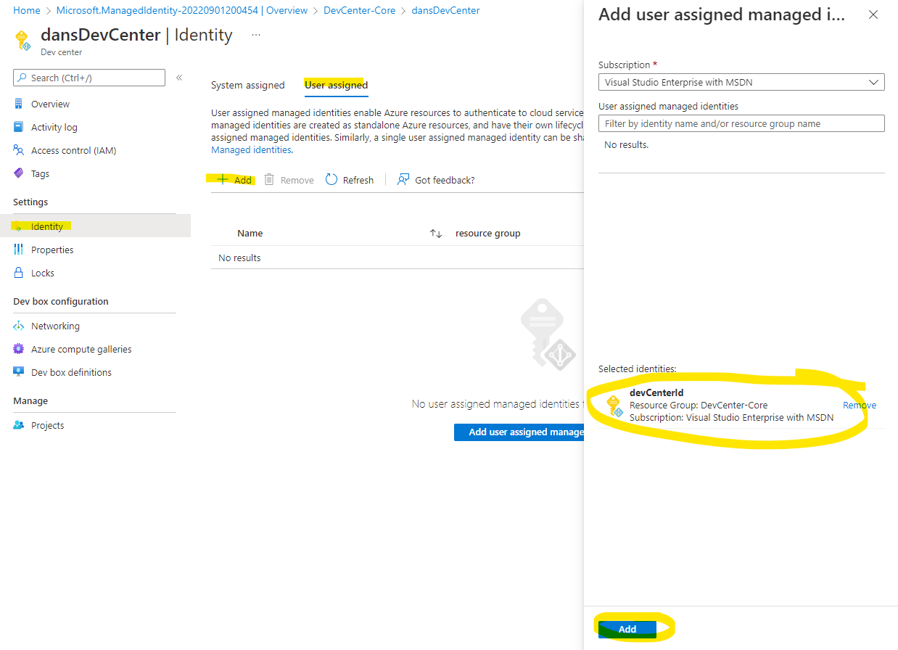

In order to use our custom image that we created previously with our **Dev Center** we need to place it in an **Azure Compute Gallery**.

-   In the Azure Portal open the **"Create"** menu once again and search for **"Compute Gallery".**
-   Select **"Create"** to start creating your compute gallery.
-   Pick a descriptive name for the gallery resource and choose the **"DevCenter-Core"** resource group.
-   Ensure that you are still using **the same Azure region** that you have been using throughout the lab.
-   Finally click **"Review and Create"** and **confirm the creation of the resource**. It will take a few moments for the compute gallery to show up in the resource group.
-   Once the deployment completes **go to its resource blade**, where we'll add the image.
-   Once on the resource blade, select **"Add"** and then select **"VM image definition"** to start the process of adding an image.

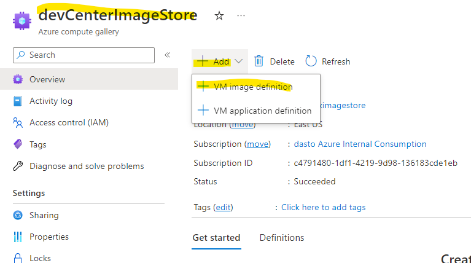

-   In the creation blade, choose "**customDevImage"** as the definition name.
-   Ensure that you **maintain the same Azure region where your image is located**.
-   Ensure that you have chosen **"Windows" as the platform**. Dev Box does not support Linux images.
-   You must configure the security type as **"Trusted Launch"** for compatibility reasons but can pick all other options based on your personal preference.

> **Note:** The underlying Windows 365 platform requires all image definitions to use "Trusted Launch" as their security type.

-   The image has been **generalized** for you and the **architecture** to pick is **x64**.
-   You can come up with **your own values for "Publisher", "Offer" and "SKU".** You use these values to search for your image in large galleries and to provision machines programmatically.
    -   An example might be
        -   The publisher **"Microsoft"**, releases their **"Windows"** offer of the SKU **"Developer-Win11-VisualStudio"**

-   Once you are done **confirm all dialogues and create the definition**.

It will take a few moments for this process to complete.

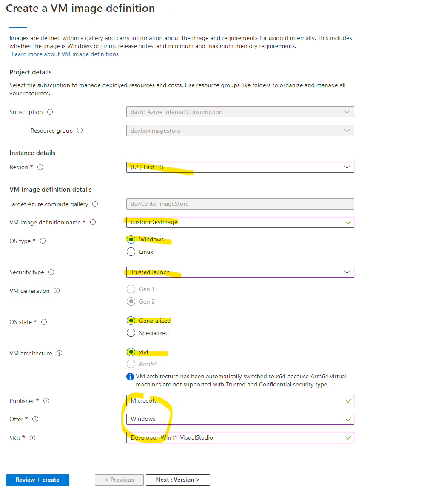

-   Once your definition has been created return to the **resource blade** of the compute gallery.

-   Select the **"Definitions"** tab where your definition should now show up.

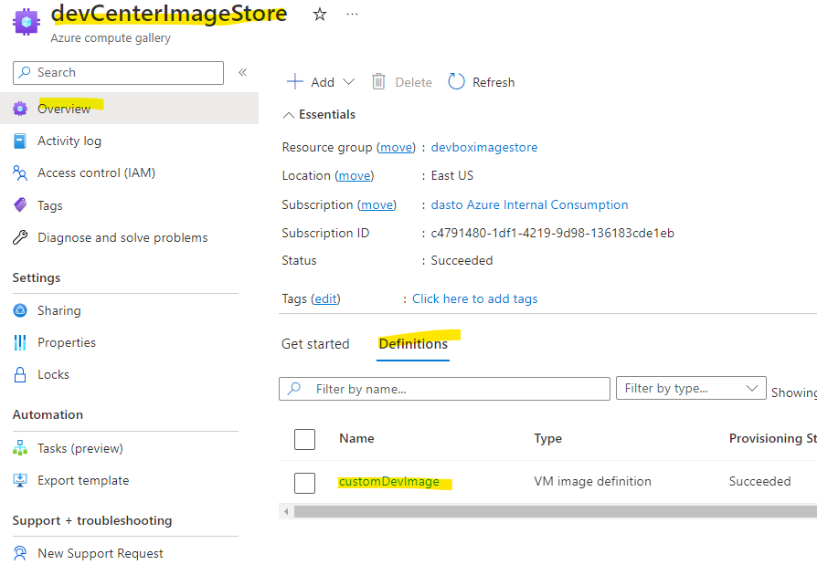

-   **Click the name of the definition** which will take you to the **definition's blade.**

-   Once on the blade choose the option to **"Add version"**

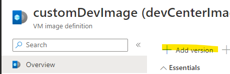

-   You will land on another blade where you can add your managed image. To do this, select **"Managed Image"** for the **Source**. You should then be able to **pick the image you created** earlier as the **"Source Image"**

-   **Pick a version number** for the image.
    -   It can be any version number, for example: "1.0.0"

-   Confirm by clicking **"Review and Create"** and **confirming the creation**.

-   This process will take a few minutes and the image version will eventually show up in the "versions" tab of the image definition blade.

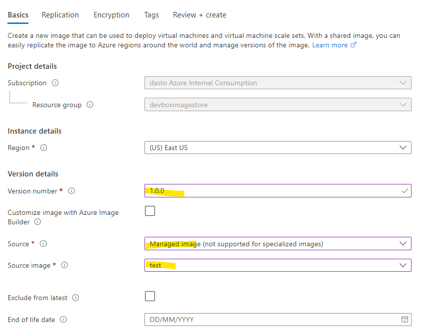

While we wait for this process to complete, we can start creating dev box definitions that leverage both our custom and the built-in images.
The first step will be to make our Dev Center aware of our custom image gallery.

-   **Return to the "DevCenter-Core" resource group** in the Azure Portal and select your Dev Center resource.

-   First select **"Azure Compute Galleries"** in the side bar and use the **"Add compute gallery"** button to add the gallery you just created.

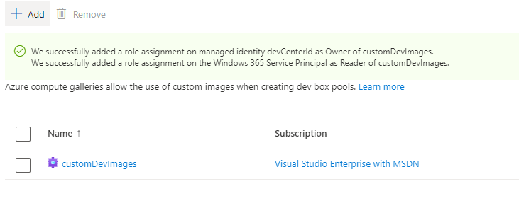

-   To create a second Dev Box definition, select **"Dev box definitions"** in the side bar.

-   Select the **"Create"** option in the blade that appears.

-   We will call this definition the **"custom"** definition.

-   Click **"See all images"** to make sure the custom image you just added is in the list. **Select it by clicking its name** and confirming with the **"Select"** button.

-   Select the **"latest"** image version

-   Select **8 vCPUs and 32 GB of RAM**

-   Select the **smallest storage option** to keep costs lower

-   Finally click **"Create"**

> **Note:** At the time of writing a UI bug prevented the custom image name from being displayed correctly in the summary screen. The image creation - however - completed just fine.

-   **Wait a few moments while the image is analyzed** and confirm that it moves to the **"Succeeded"/"No Errors"** state.

-   Now that your definition has been created, **you can delete the resource group where you spun up the VM used to capture the custom image**.

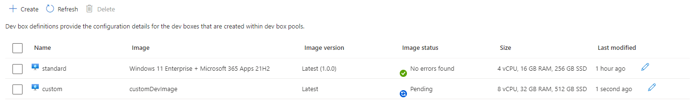

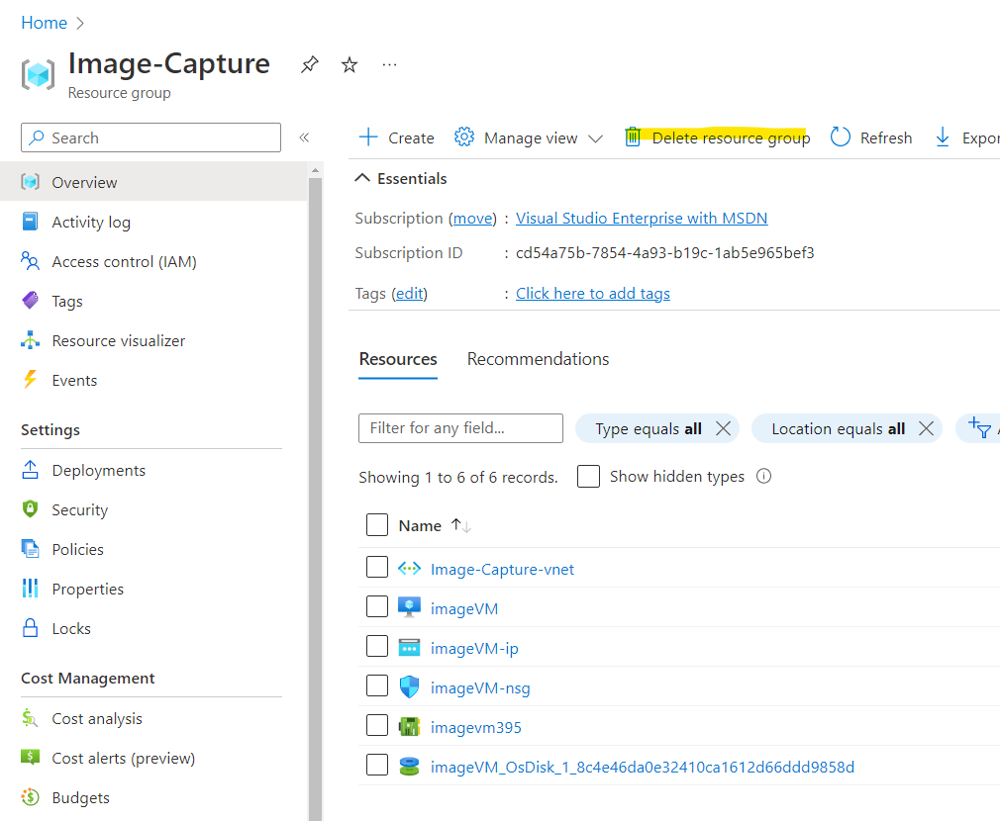

### Assign permissions to the other two personas

As a final step in this lab, we will give permissions to our Dev Manager account to manage the project that they are working on. We will also give our Developer the ability to create Dev Boxes for this project and create a deployment target for them to use later.

-   **Return to the "DevCenter-Core" resource group** in the Azure
    Portal and select your Dev Center resource.

-   **On the "Overview" blade** select the **"Create Project"** button

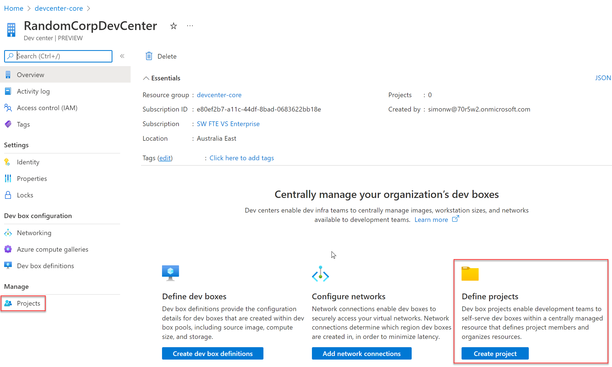

-   Pick a **project name** and description and hit **"Create"**

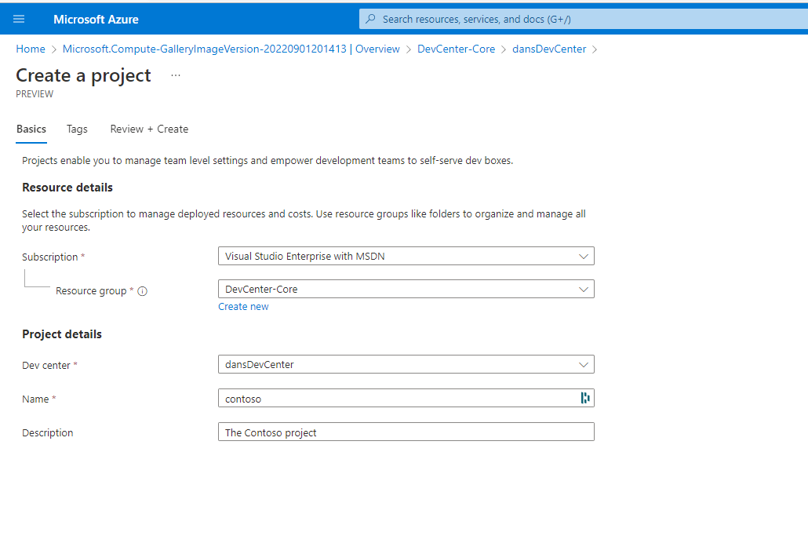

Once the project is created, we need to assign roles to it.

-   **Return to the "DevCenter-Core" resource group** in the Azure Portal and select **the newly created project resource**.

-   You can either select the **"Set project access - Edit access"** button on the **"Overview"** blade or select **"Access Control (IAM)"** in the side bar.

-   Assign the "Development Manager" (Adele) the **"DevCenter Project Admin"** role and the **"Owner"** role by going to the **"Role Assignment"** tab and picking the roles and then selecting her user identity. You can use Option 1 or 2 to access the assignment screens.

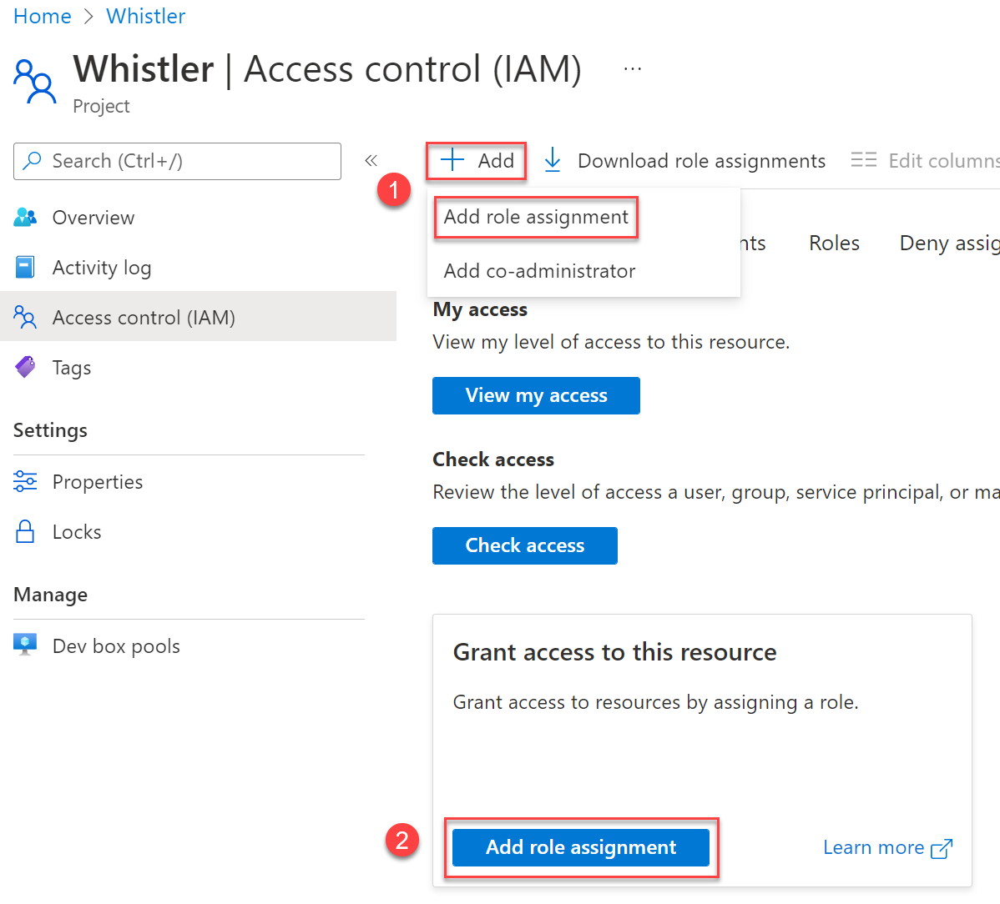

**Note**: The reason why we add the "**Owner**" role here is to allow the "Development Manager (Adele)" to add a developer in the team to a Dev Box Project as a "dev box user" role.  [Here](https://learn.microsoft.com/en-us/azure/dev-box/how-to-manage-dev-box-projects#permissions) is the reference to the permissions required to manage a dev box project.

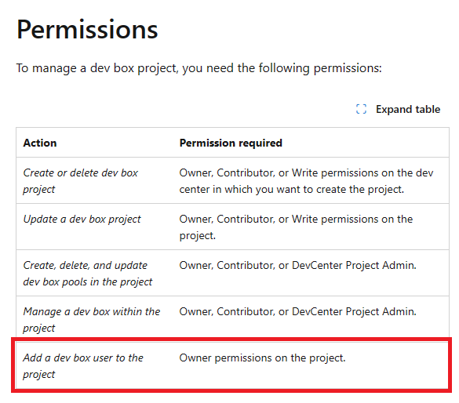

-   Follow the same steps to give the "Developer" (Alex) the **"DevCenter Dev Box User"** role and the **"Reader"** role on the project resource.

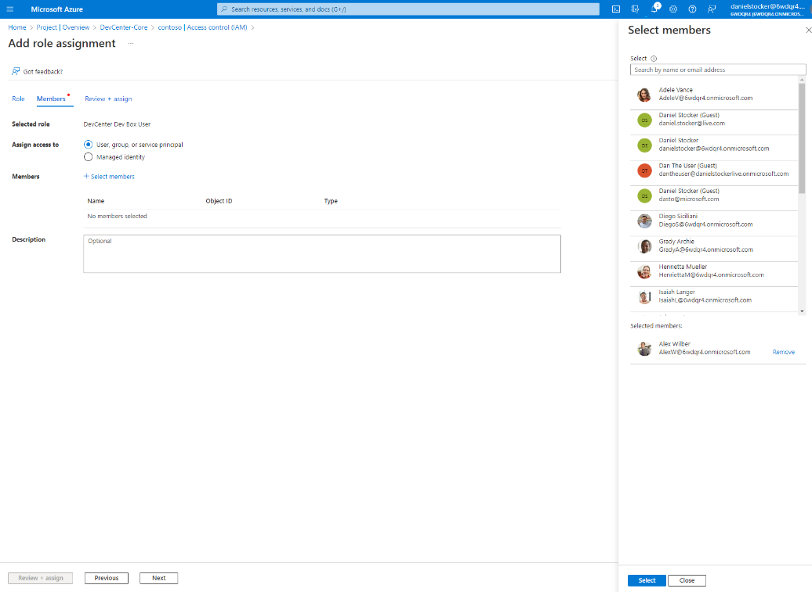

Finally, we also want to create a target environment for deployment via
the dev box at a later stage.

-   Use the **"Create"** menu to create a new resource group called **"Deployment-Target"**

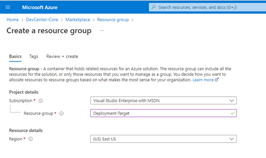

-   Continue to use the same region as before

-   Once the resource group is deployed, access its blade via the portal and go to the **"Access Control (IAM)"** pane via the side bar.

-   Go through the same role assignment process that you just
completed, but this time...
    -   ...add the development manager as an Owner
    -   ...add the developer as a Contributor

> **Note:** The development manager persona would most likely perform this second step, but we're doing it on the admin user here for efficiency.

This lab is now complete.

# Lab 2 - Development Manager Persona

The steps in this lab will take you about 15 minutes to complete.

We recommend that you remain logged in as the Admin account in your main browser window and open a separate "Incognito"/ "InPrivate" window to perform the upcoming actions as the "Development Manager" (Adele) persona.

-   Using the credentials that you noted down in the previous lab, **log into the Azure Portal as the "Development Manager"** and perform any tasks necessary to reset your password.

-   Once in the Azure Portal select **"All resources"**. You should see only the project resource that we created at the end of the previous lab.

    -   If you do not see the project resource, return to the last task of the previous lab and verify that you are using the correct user account and that the user account has the relevant project admin permission.

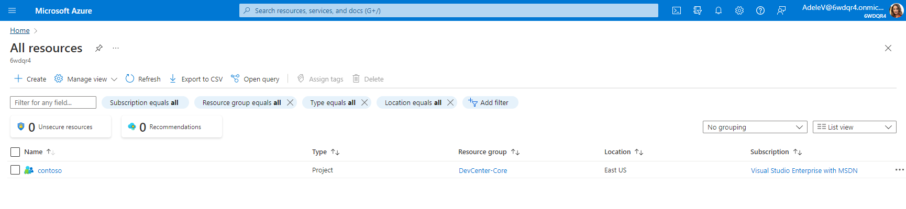

-   Select the project resource and then select **"Dev box pools"** in the sidebar of the blade that appears.

-   Click the **"Create"** button to create a new definition and complete the form confirming your choices by once again clicking **"Create".**

-   Complete this process twice for two definitions. See the next page for a sample screenshot.

|                            | Definition 1                                       | Definition 2                                       |
|--------------|--------------------------|--------------------------|
| Name                       | m365box                                            | devbox                                             |
| Definition                 | standard                                           | custom                                             |
| Network Connection         | the network connection created in the previous lab | the network connection created in the previous lab |
| Dev Box Creator Privileges | Local Admin                                        | Local Admin                                        |
| Licensing                  | [x]                                                | [x]                                                |

We recommend exploring the **"Learn more about dev box licensing requirements"** link in the "Create" menu while you are waiting for your dev box definitions to validate.

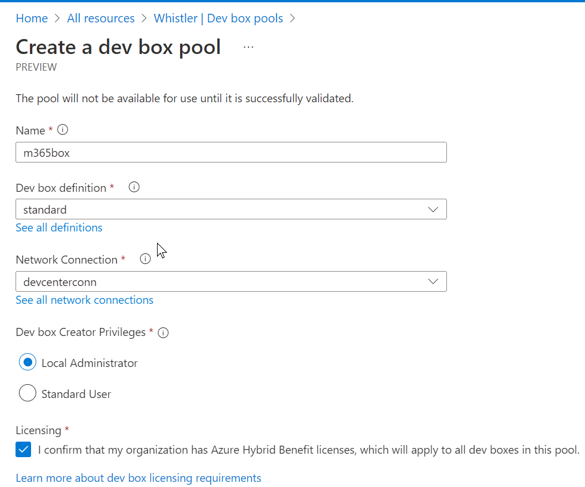

-   The Dev box pools blade will now show the two Dev Box pool definitions. Their validation might take a few minutes.
    -   It is a good idea to wait for the completion of the validation as any issues with earlier tasks in the lab will surface now. 
    -   Creating a Dev Box definition requires all components of the Dev Center to work seamlessly together.

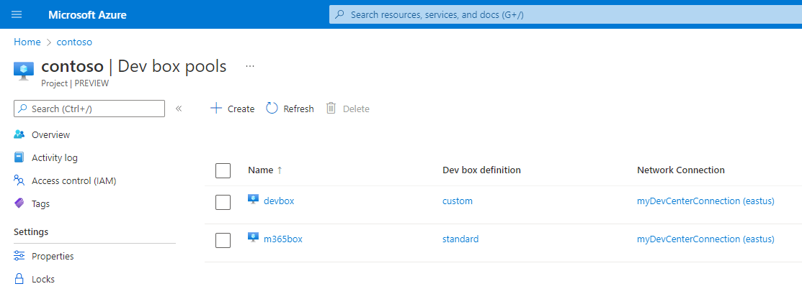

This lab is now complete.

# Lab 3 - Developer Persona

The steps in this lab will take you about 20 minutes to complete. This
excludes the time that it takes to provision the Dev Box instances which
can take between 30 and 90 minutes each.

## Create a Dev Box

We recommend that you remain logged in as the Admin account in your main browser window and open a separate "Incognito"/ "InPrivate" window to perform the upcoming actions as the "Developer" (Alex) persona.

-   Using the credentials that you noted down from Lab 1, **log into the [Dev Box Portal](https://aka.ms/devbox-portal) as the "Developer" user (Alex)** and perform any tasks necessary to reset your password.

> **Note:** The Dev Box Portal URL is not the same as the Azure Portal.

-   Once in the Dev Box portal you should see an option to create a new Dev Box.

    -   If you do not see the option, return to the task where you assigned the user permissions and double check that you are logged in with the same account that has the user permissions.

    -   If you need to adjust permissions, it may take up to 5 minutes for them to reflect in the Dev Box portal.

    -   To avoid cached responses always open a new Incognito window and log in again.

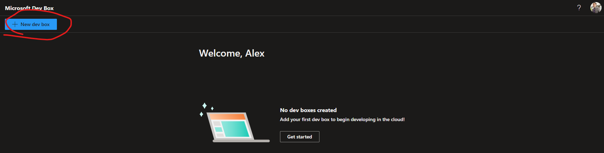

-   Click the option to **create a new dev box**
    -   Create a **box called "vs2022" in the devbox pool**
    -   Create a **box called "m365" in the m365box pool**

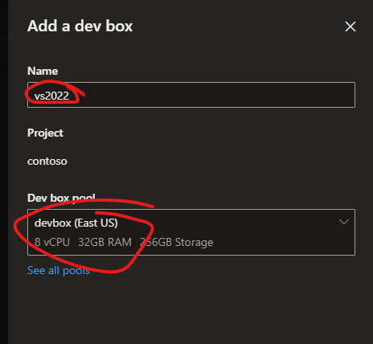

-   **Confirm the creation** of both boxes. The Microsoft Dev Box service will now start creating the Dev Boxes. This will take roughly 30 minutes.

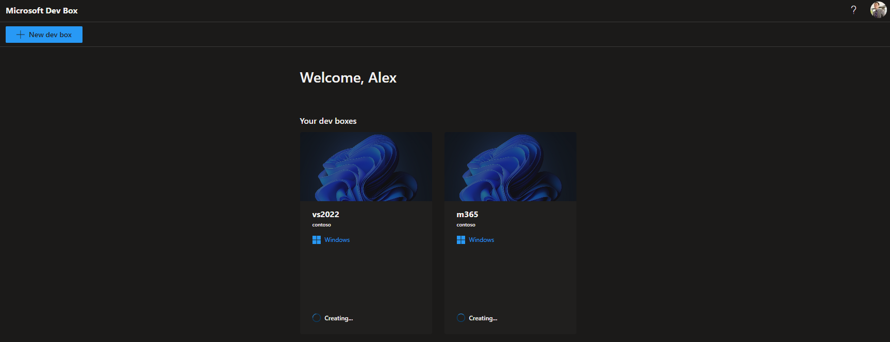

**OPTIONAL:** Before you return to the Incognito/InPrivate window where you started the creation of your Dev Boxes, you can check the virtual network that you created as the Admin (M365 tenant admin) user. It should now have two virtual network interfaces attached to it, one for each Dev Box.

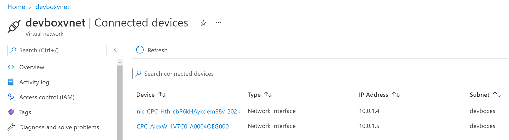

**OPTIONAL:** You can also use your Admin (M365 tenant admin) account to log into the [Microsoft Endpoint manager](https://endpoint.microsoft.com/#home) where both Dev Boxes will be registered when created. It may take a few minutes for the devices to show up as they are provisioned and it is not until provisioning is finished that all the device details populate in Endpoint Manager.

We will not go into a lot of detail on InTune and its features in this lab, but you can explore the user interface to see the features that are available to you there. It includes things such as auto-provisioning apps to all of your devices or restricting the use of certain apps based on organizational policy.

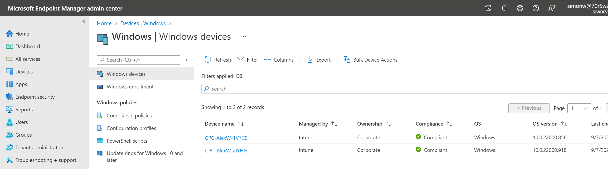

## Use a Dev Box for a simple deployment with Visual Studio

-   Return to **the [Dev Box Portal](https://aka.ms/devbox-portal) as the "Developer" user** **(Alex)** and review the status of your Dev Boxes. Hopefully they have come online while you were away.

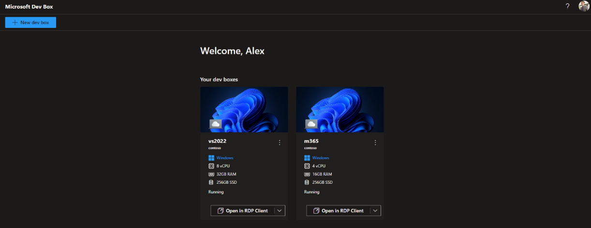

-   Test the connection experience to **either box via the browser** and the **Remote Desktop Client on your machine**. You may need to download an updated client if the one you have does not work. This is an option from the Dev Box RDP connection menu.
-   Once you have confirmed that both Dev Boxes are working, we will only continue with the "vs2022" box for the rest of the lab. Feel free to **delete the "m365" box at this stage by clicking "..." > "Delete"**
-   **Connect to the vs2022 box** and **open Visual Studio** which is already pre-installed as part of the VM Image.
-   Once in Visual Studio **choose to create a new project**

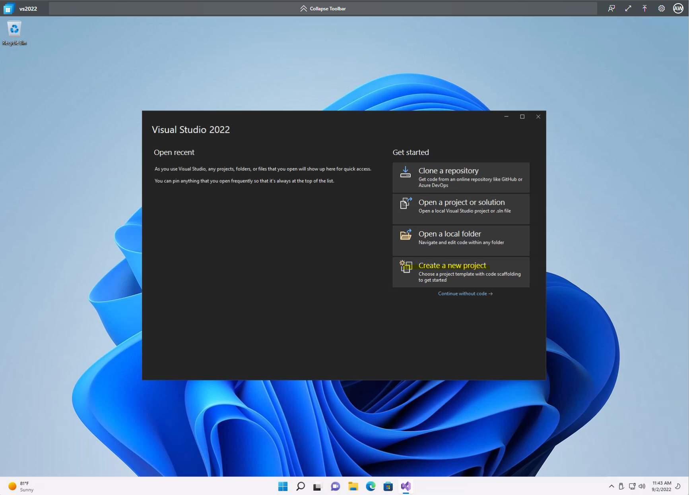

-   Create **a new ASP.NET Core Web App.** You can pick your own name for the web application. Stick with all defaults until you are prompted to **Create** the app. Confirm the dialogue to move into the main view of Visual Studio.

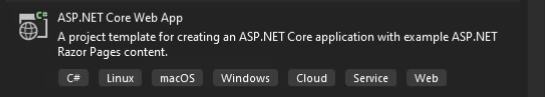

Next we will deploy the code directly from our Dev Box in Visual Studio
to our Deployment-Target resource group. To do this we will do a simple
deployment from Visual Studio.

-   In the **"Solution Explorer"** right click your web application and choose **"Publish..."**
-   In the menu **choose "Azure"**

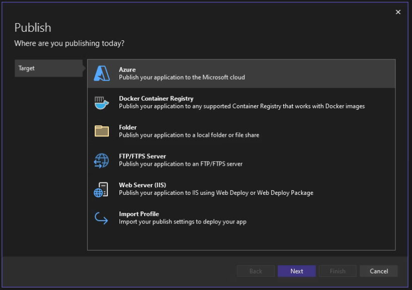

-   Choose the **"Azure App Service (Windows)"** deployment option and continue.
-   On the next page choose to **sign in** and sign in with your developer credentials. (Alex)

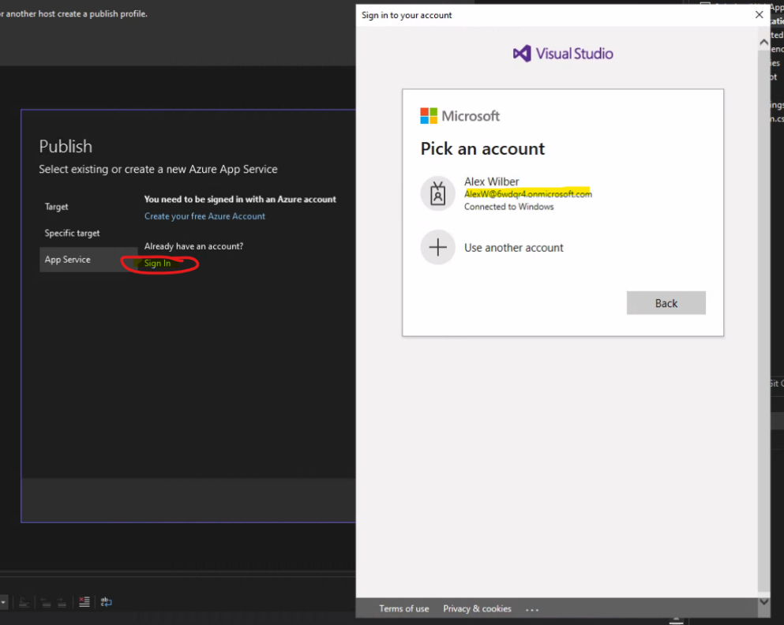

-   The **"Publish"** window should now appear giving you the option to **"create a new"** App Service.
-   Confirm the defaults to create a new app service

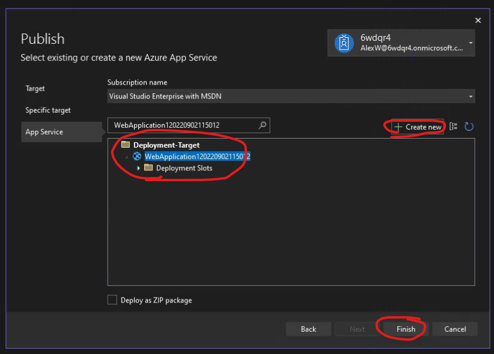

-   Once complete hit **"Finish"** and then **"Close"**
-   You should now see a screen allowing you to **"Publish"** the app

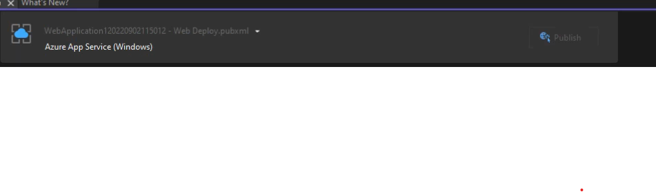

-   Once the deployment completes you should see the website in the browser of your Dev Box.

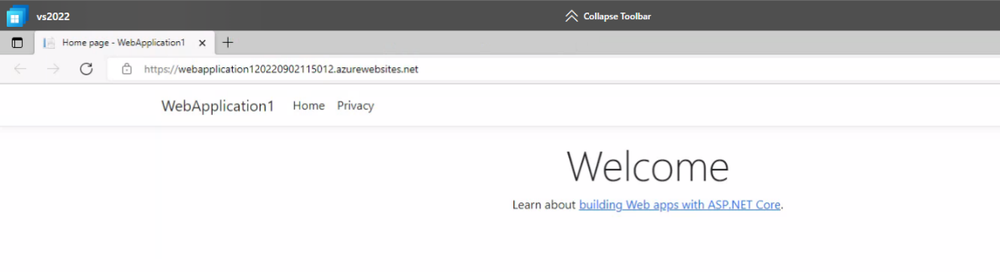

This lab is now complete.

# Lab 4 - Clean-Up

To avoid any unexpected charges, **ensure that your dev boxes are deleted** if you are not using them for
a while.
Return to your main browser window with your Admin account and **clear out any resources that you no longer need**.

If you disabled any Azure AD security features to move through the lab quicker, **this is the time to re-enable them.**
If you would like to keep resources deployed, ensure that you **stop the Dev Box instances via the Dev Box Portal** (in future instances will hibernate when unused, but this feature is not yet available).

Thank you for completing the lab!

# Lab 5 - Already finished? Optional Bonus activities!

## Try App Templates

App Templates can help you quickly deploy a specific solution including demo code to an Azure environment from a GitHub repo.

-   Using App Templates with Microsoft Dev Box allows you to demo the end-to-end developer experience as well as the Azure deployment.
-   Try deploying an App Template and pulling its code repo in a dev box with Visual Studio installed.   

<https://github.com/microsoft/App-Templates>

## Try Infrastructure as Code

During this lab we performed most actions in the user interface, but that doesn't mean that the provisioning of a Microsoft Dev Box environment can't be automated.

Follow the instructions here to provision a Dev Box environment from scratch using Bicep: [ljtill/bicep-devbox: Microsoft Dev Box platform built with Azure Bicep including GitHub Actions workflows](https://github.com/ljtill/bicep-devbox/)
